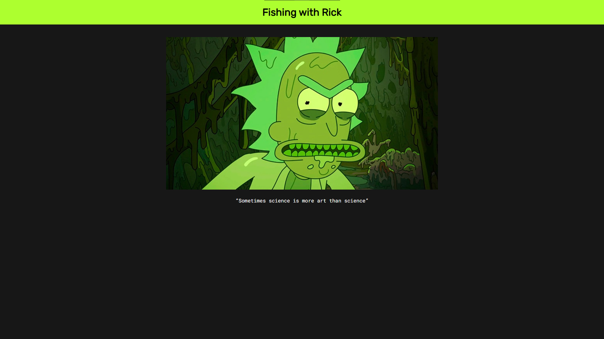

# Rick The Bot
IP logging via Discord

# How Does It Work?
Once the target has opened the link to the site, their IP will be used to determine some GEO location and device info.     
All this will be sent to a Discord chat via a webhook in the form of an embed.     

## Rick Roll
Once the user has opened the link, they will be rick rolled.    
If the page is scraped by bots it will redirect them to a *no access page*.       

## Deployment
The intended platform for deployment is *Vercel*, though it can be used anywhere.
1. Deploy the project to Vercel
2. Set the URL of the webhook so, add a [Vercel environment variable](https://vercel.com/docs/projects/environment-variables) called `URL`.
